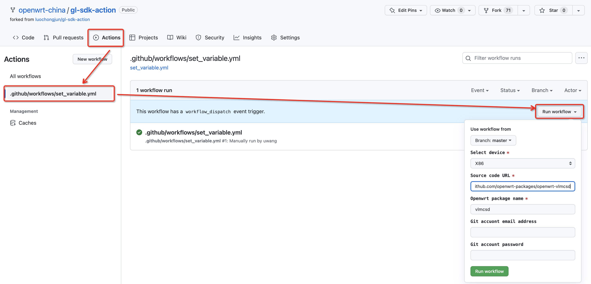
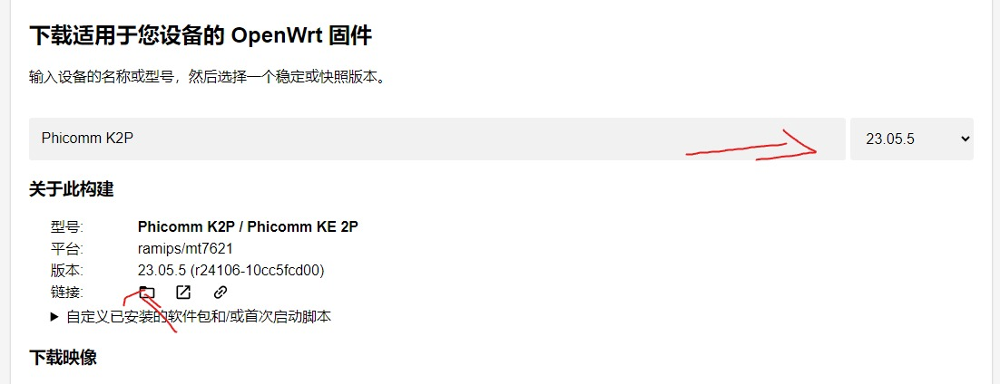
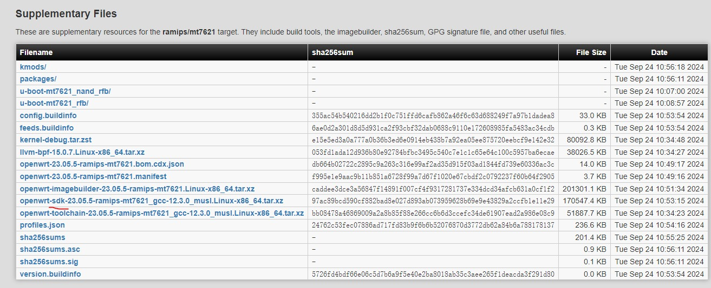

# sdk-action



fork 后会自动切到自己的仓库：
   1. 切到Action页面
   2. 选择set_variable 工作流
   3. 点击run workflow按钮   . 选择需要编译的目标设备
   4. 在下拉输入框source code URL中填入需要编译的插件源码地址（注意使用https，不要使用ssh, 例：https://github.com/luochongjun/edgerouter.git ）
   5. 在下拉输入框Openwrt package name中填入需要编译的插件名 （要编译的插件名字，例：edgerouter）
   6. 如果源代码需要认证信息可以输入邮箱和密码，如果没有则留空
   7. 点击Run workflow

接下来会自动执行编译，编译时间快的可能2，3分钟，取决于插件本身的编译时间

编译完成后，点击对应工作，可查看编译好的插件压缩包，压缩包中包含了你需要编译的插件以及所有依赖软件包

下载解压后找到需要的ipk文件

将ipk文件传到路由器后台，使用 opkg 命令安装.

# 获取openwrt官方源码([点击这里](https://firmware-selector.openwrt.org/))


下拉到最下面选择SKD


```bash
opkg install /tmp/*.ipk
```

## 可选的包

<table width="100%">
   <thead>
      <tr>
         <th>仓库</th>
         <th>名称</th>
      </tr>
   </thead>
   <tbody>
      <tr>
         <td>https://github.com/openwrt-packages/openwrt-vlmcsd</td>
         <td>openwrt-vlmcsd</td>
      </tr>
      <tr>
         <td>https://github.com/openwrt-packages/luci-app-vlmcsd</td>
         <td>luci-app-vlmcsd</td>
      </tr>
      <tr>
         <td>https://github.com/openwrt-packages/helloworld</td>
         <td>luci-app-ssr-plus</td>
      </tr>
      <tr>
         <td>https://github.com/openwrt-packages/luci-app-bandwidthd</td>
         <td>luci-app-bandwidthd</td>
      </tr>
      <tr>
         <td>https://github.com/openwrt-packages/luci-app-clash</td>
         <td>luci-app-clash</td>
      </tr>
   </tbody>
</table>p
```